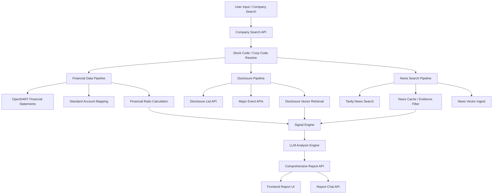
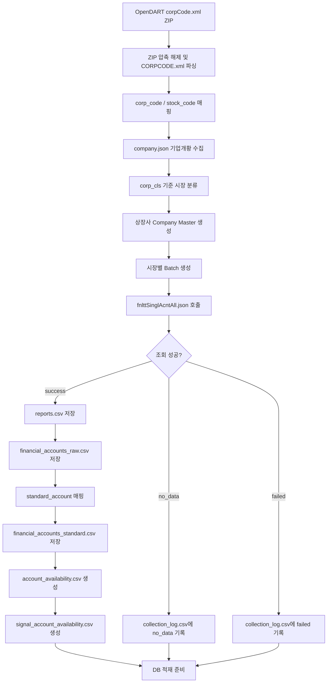
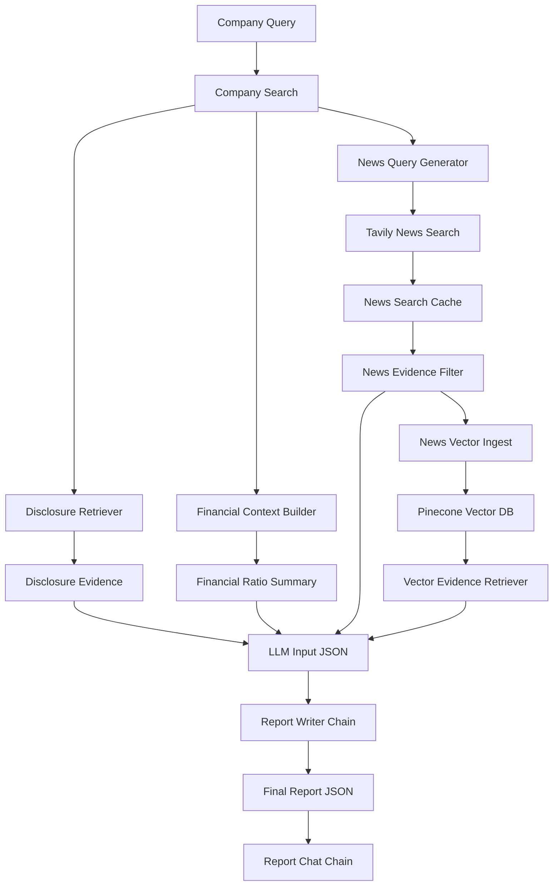

# FINANCE_DOT_ZIP

> OpenDART 기반 기업 재무 분석 및 AI 리포트 생성 시스템

상장기업의 재무제표, 공시, 뉴스 데이터를 수집하고 재무지표와 시그널을 분석하여 AI 기반 종합 리포트와 챗봇 응답을 생성하는 금융 분석 플랫폼입니다.


---

## 목차

1. [프로젝트 개요](#1-프로젝트-개요)
2. [팀 소개](#2-팀-소개)
3. [기술 스택](#3-기술-스택)
4. [시스템 아키텍처](#4-시스템-아키텍처)
5. [데이터 흐름](#5-데이터-흐름)
6. [주요 기능](#6-주요-기능)
7. [AI 분석 및 Vector RAG 구조](#7-ai-분석-및-vector-rag-구조)
8. [데이터 설계](#8-데이터-설계)
9. [설계 선택 이유](#9-설계-선택-이유)
10. [프로젝트 구조](#10-프로젝트-구조)
11. [실행 방법](#11-실행-방법)
12. [서비스 시나리오](#12-서비스-시나리오)
13. [한계 및 향후 개선 방향](#13-한계-및-향후-개선-방향)
14. [동료 회고](#14-동료-회고)

---

## 1. 프로젝트 개요

### 서비스 배경

기업 분석을 위해서는 재무제표, 공시, 뉴스, 산업 정보 등 여러 출처의 데이터를 함께 확인해야 합니다. OpenDART는 공시와 재무제표 데이터를 제공하지만, 원본 계정명이 기업마다 다르고 일부 계정은 누락될 수 있어 바로 분석에 사용하기 어렵습니다.

본 프로젝트는 OpenDART 기반 데이터 수집 파이프라인과 AI 분석 엔진을 결합하여 기업 종합 리포트를 자동 생성하는 것을 목표로 합니다.

### 핵심 목표

- OpenDART API 기반 상장기업 정보 및 재무제표 수집
- KOSPI, KOSDAQ, KONEX 시장별 batch 수집 구조 구성
- 전체 재무제표 API 기반 raw 계정 수집 및 표준계정 전처리
- 재무비율, Warning Signal, Positive Signal 계산 기반 마련
- 공시, 사업보고서, 뉴스 기반 Vector RAG 검색 구조 구현
- 기업 검색 API, 종합 리포트 API, AI 리포트 API, 리포트 챗봇 API 제공
- LLM을 활용한 재무 분석 결과 요약 및 근거 기반 리포트 생성

### 기대 효과

- 기업 재무제표 수집 및 전처리 자동화
- 기업별 재무상태와 위험 신호를 빠르게 확인
- 공시, 뉴스, 재무지표를 함께 반영한 종합 분석 가능
- 기업 리서치, 취업·면접 준비, 팀 프로젝트 분석 자료 생성 시간 단축
- 투자 추천이 아닌, 공시·뉴스·재무지표 기반 기업 분석 보조 정보 제공

---

## 2. 팀 소개

**Team Finance Dot ZIP**  
기업의 숫자와 공시를 압축해서 읽기 쉬운 리포트로 풀어내는 금융 분석 팀입니다.

<table align="center">
  <tr>
    <td align="center" width="160">
      <br>
      <b>김이선</b><br>
      <a href="https://github.com/kysuniv-cyber">@kysuniv-cyber</a>
    </td>
    <td align="center" width="160">
      <br>
      <b>김지윤</b><br>
      <a href="https://github.com/JiyounKim-EllyKim">@JiyounKim-EllyKim</a>
    </td>
    <td align="center" width="160">
      <br>
      <b>박소윤</b><br>
      <a href="https://github.com/parksoyun9084-cloud">@parksoyun9084-cloud</a>
    </td>
    <td align="center" width="160">
      <br>
      <b>박은지</b><br>
      <a href="https://github.com/lo1f0306">@lo1f0306</a>
    </td>
    <td align="center" width="160">
      <br>
      <b>위희찬</b><br>
      <a href="https://github.com/dnlgmlcks">@dnlgmlcks</a>
    </td>
    <td align="center" width="160">
      <br>
      <b>홍지윤</b><br>
      <a href="https://github.com/jyh-skn">@jyh-skn</a>
    </td>
  </tr>
</table>

| 이름 | 역할 | 담당 |
| --- | --- | --- |
| 김이선 | UI & 시각화 - 프론트엔드 | - Plotly.js 기반 재무 추이 차트 구현<br>- 동적 대시보드 구현<br>- 분석 리포트형 HTML/CSS 레이아웃 설계 |
| 김지윤 | AI & Agent | - LangChain 기반 AI 리포트 생성 파이프라인 설계<br>- MySQL 재무 데이터와 Vector DB 근거를 결합한 Hybrid Chain 구현<br>- Tavily 뉴스 검색 및 Evidence Filter 연동<br>- AI 리포트 생성 Chain과 리포트 챗봇 Chain 구현<br>- 재무 용어 응답 및 챗봇 안전 필터링 로직 보강 |
| 박소윤 | Data Engineering - DB/Infra & Retrieval | - MySQL·Vector DB 기반 Hybrid Retrieval 구조 설계<br>- metadata filtering 및 disclosure/news retrieval 구현<br>- signals·detected_changes 기반 AI 검색 입력 및 API schema 설계<br>- Frontend·AI 연동 인터페이스 안정화 |
| 박은지 | PM/문서화/API 명세 | - 일정 관리 및 문서화 총괄<br>- API 명세 관리<br>- 리포트 논리 구조 설계<br>- 재무 데이터 거버넌스 및 뉴스 검색 임계치 기준 수립 |
| 위희찬 | Data Engineering - 수집/가공 | - OpenDART 재무제표 수집<br>- 핵심 재무계정 기반 5개년 데이터 수집<br>- 재무비율 산출 및 MySQL 적재 준비<br>- 공시 텍스트 청킹 |
| 홍지윤 | UI & 시각화 - 웹 프레임워크/연동 | - FastAPI/Django 기반 백엔드 서버 초안 구성<br>- AI 로직 및 DB 데이터를 프론트엔드로 전달하는 API 연동<br>- 비동기 로딩 화면 구현 |

---

## 3. 기술 스택

### Core

- Backend Framework: Django, Django REST Framework
- API 실험/보조 모듈: FastAPI, Uvicorn
- Language: Python
- Data Processing: pandas, csv, json, zipfile, XML parser
- LLM Framework: LangChain
- LLM: OpenAI 계열 LLM
- Prompt Engineering: Report Writer Prompt, News Evidence Filter Prompt, Chat Prompt

### Data & API

- OpenDART API
  - `corpCode.xml`
  - `company.json`
  - `fnlttSinglAcntAll.json`
  - `list.json`
  - 주요사항보고서 주요정보 API
- Tavily Search API

### Database & Retrieval

- Structured DB: MySQL
- Vector DB: Pinecone
- Embedding: OpenAI Embeddings, `text-embedding-3-small`
- Vector Search: metadata filtering 기반 공시/뉴스 근거 검색
- Data Export: CSV, JSON

### Frontend & Visualization

- React
- Vite
- CSS
- 기업 검색 화면
- 종합 리포트 화면
- 뉴스 분석, 공시 분석, 재무 분석 화면
- AI 챗봇 패널

---

## 4. 시스템 아키텍처



### 시스템 구성 요약

- 기업 검색 API: 회사명 또는 종목코드 입력을 기반으로 분석 대상 기업 식별
- 재무 데이터 파이프라인: OpenDART 전체 재무제표 API 수집 및 표준계정 변환
- 공시 파이프라인: 전체 공시 목록 및 주요사항 이벤트 기반 시그널 확인
- 뉴스 검색 파이프라인: Tavily 기반 최신 뉴스 검색, 캐싱, Evidence Filter 적용
- Vector RAG: Pinecone 기반 공시/뉴스 근거 검색 및 metadata filtering
- AI 분석 엔진: 재무지표, 공시, 뉴스 근거를 종합하여 리포트 및 챗봇 답변 생성

---

## 5. 데이터 흐름

### Financial Data Pipeline



### 기타 Flow

- Company Search Flow: 회사명, 종목명, 종목코드 기준으로 `stock_code`, `corp_code` 반환
- Disclosure Event Flow: 부도, 영업정지, 합병, 분할, 영업양수도 등 주요사항보고서 이벤트 조회
- Disclosure Vector Flow: 공시/사업보고서 chunk를 Pinecone에서 검색하여 리포트 근거로 변환
- News Analysis Flow: Tavily 뉴스 검색, 캐시 활용, Evidence Filter, Vector DB 실시간 적재 후보 생성
- AI Report Flow: 재무지표, 공시 이벤트, 뉴스 근거, 산업 정보를 종합하여 LLM 분석 결과 생성
- Report Chat Flow: 생성된 리포트 context와 chat history를 기반으로 후속 질문 답변 생성

---

## 6. 주요 기능

### 1. OpenDART 기업 코드 매핑

- `corpCode.xml` ZIP 응답 압축 해제 후 XML 파싱
- `corp_code`, `stock_code`, `corp_name` 추출
- `company.json`으로 `stock_name`, `corp_cls`, `induty_code`, `acc_mt` 보강
- `corp_cls` 기준 시장 분류

```text
Y -> KOSPI
K -> KOSDAQ
N -> KONEX
E -> OTHER
```

`corp_code`와 `stock_code`의 역할:

```text
corp_code  = OpenDART 내부 회사 고유번호
stock_code = 증권시장 종목코드
```

예시:

```text
삼성전자   corp_code=00126380, stock_code=005930
현대자동차 corp_code=00164742, stock_code=005380
NAVER      corp_code=00266961, stock_code=035420
```

### 2. 상장사 Company Master 생성

OpenDART 기업개황 API 기반 상장사 master를 생성하고, 시장별 batch 수집 기준 파일을 관리합니다.

현재 로컬 master 기준:

| 구분 | 기업 수 |
| --- | ---: |
| 전체 | 3,963 |
| KOSPI | 838 |
| KOSDAQ | 1,817 |
| KONEX | 110 |
| OTHER | 1,198 |

참고: OpenDART API 최신 `corpCode.xml` 직접 확인 기준으로 `stock_code`가 있는 항목은 3,964개이며, 현재 로컬 master와 1개 차이가 있습니다.

주요 파일:

- `data/company_master/listed_companies_master.csv`
- `data/company_master/company_master_log.csv`
- `data/company_master/company_batch_summary.md`
- `data/company_master/companies_for_db.csv`

### 3. Batch 기반 재무제표 수집

시장별 기업을 batch 단위로 분리하여 수집 안정성을 확보합니다.

수집 기준:

```text
years: recent5
reprt_code: 11011
fs_div: CFS 우선, no_data 시 OFS fallback
source_api: fnlttSinglAcntAll.json
```

`recent5`는 실행일 기준 최근 5개 사업연도를 자동 계산합니다.
사업보고서 공시 시점을 고려하여 4월 이후에는 전년도까지, 1-3월에는 전전년도까지를 최신 사업연도로 봅니다.
예를 들어 2026년 5월 실행 시 수집 대상은 2021-2025년입니다.

생성된 batch:

| batch_id | 기업 수 |
| --- | ---: |
| kospi_001 | 500 |
| kospi_002 | 338 |
| kosdaq_001 | 500 |
| kosdaq_002 | 500 |
| kosdaq_003 | 500 |
| kosdaq_004 | 317 |
| konex_001 | 110 |

### 4. 전체 재무제표 API 수집

기존 주요 재무제표 API인 `fnlttSinglAcnt.json`은 기본 계정 중심이라 상세 계정 확보에 한계가 있습니다. 본 프로젝트에서는 전체 재무제표 API인 `fnlttSinglAcntAll.json`을 사용합니다.

보완된 주요 계정:

- 재고자산
- 매출채권
- 단기차입금
- 장기차입금
- 사채
- 금융비용
- 영업활동현금흐름

전체 batch 수집 결과:

| 항목 | 건수 |
| --- | ---: |
| 전체 회사 수 | 2,765 |
| collection_log rows | 17,983 |
| success | 12,031 |
| no_data | 5,952 |
| failed | 0 |
| rate_limited | 0 |
| reports rows | 12,031 |
| financial_accounts_raw rows | 2,135,144 |
| financial_accounts_standard rows | 331,236 |
| standard amount 빈 값 | 2,992 |
| fs_div 빈 값 | 0 |

### 5. 표준계정 매핑 및 전처리

기업별로 다른 재무제표 계정명을 표준계정으로 매핑합니다.

- exact match 우선 적용
- 부분 문자열 매칭은 fallback으로만 사용
- `비유동자산`과 `유동자산`, `비유동부채`와 `유동부채` 오매핑 방지

주요 표준계정:

- 매출액
- 영업이익
- 당기순이익
- 자산총계
- 부채총계
- 자본총계
- 유동자산
- 유동부채
- 현금및현금성자산
- 재고자산
- 매출채권
- 유형자산
- 영업활동현금흐름
- 단기차입금
- 장기차입금
- 사채
- 이자비용
- 금융비용

### 6. DB 회사 메타데이터 적재

`companies_for_db.csv`는 리포트 API의 `company_info`, 산업 코드 매핑, 검색 API에서 사용하는 회사 기본정보 적재용 파일입니다.

적재 스크립트:

```bash
cd backend
python -m src.db.seed_companies
```

해당 스크립트는 `data/company_master/companies_for_db.csv`를 읽어 MySQL `companies` 테이블에 `stock_code`, `corp_code`, `company_name`, `induty_code`를 upsert합니다.

실행 결과 MySQL `companies` 테이블에 3,963건의 기업 메타데이터를 적재하였으며, 이를 통해 종합 리포트 API의 `company_info`, `industry_info`, `detected_changes.query_hint` 생성에 필요한 기업명과 업종코드 누락 문제를 해결했습니다.

### 7. Account Availability 생성

회사/연도별 필요한 계정이 존재하는지 검증합니다.

- 재무비율 계산 가능 여부 사전 확인
- DB 적재 전 누락 계정 확인
- Signal 계산 대상 계정의 존재 여부 확인

생성 파일:

- `account_availability.csv`
- `signal_account_availability.csv`

### 8. Collection Log 기반 수집 상태 관리

회사/연도별 수집 결과를 로그로 관리하고, 데이터 없음과 실제 오류를 분리합니다.

상태값:

```text
success
no_data
failed
rate_limited
```

`no_data`는 실패가 아니라 OpenDART 조회 결과가 없는 정상 미조회 상태로 처리합니다.

### 9. 재무비율 계산 기반

일반 텍스트 버전:

수익성 지표:

- 영업이익률 = 영업이익 / 매출액 × 100
- ROE = 당기순이익 / 자본총계 × 100
- ROA = 당기순이익 / 자산총계 × 100
- 순이익률 = 당기순이익 / 매출액 × 100

안정성 지표:

- 부채비율 = 부채총계 / 자본총계 × 100
- 자기자본비율 = 자본총계 / 자산총계 × 100
- 차입금의존도 = (단기차입금 + 장기차입금 + 사채) / 자산총계 × 100
- 이자보상배율 = 영업이익 / 이자비용

유동성/활동성 지표:

- 유동비율 = 유동자산 / 유동부채 × 100
- 당좌비율 = (유동자산 - 재고자산) / 유동부채 × 100
- 매출채권회전율 = 매출액 / 매출채권
- 재고자산회전율 = 매출액 / 재고자산

성장성 지표:

- 매출액증가율 = (현재 매출액 - 전기 매출액) / 전기 매출액 × 100
- 영업이익증가율 = (현재 영업이익 - 전기 영업이익) / 전기 영업이익 × 100

코드블럭 버전:

```text
[수익성 지표]
영업이익률 = 영업이익 / 매출액 × 100
ROE = 당기순이익 / 자본총계 × 100
ROA = 당기순이익 / 자산총계 × 100
순이익률 = 당기순이익 / 매출액 × 100

[안정성 지표]
부채비율 = 부채총계 / 자본총계 × 100
자기자본비율 = 자본총계 / 자산총계 × 100
차입금의존도 = (단기차입금 + 장기차입금 + 사채) / 자산총계 × 100
이자보상배율 = 영업이익 / 이자비용

[유동성/활동성 지표]
유동비율 = 유동자산 / 유동부채 × 100
당좌비율 = (유동자산 - 재고자산) / 유동부채 × 100
매출채권회전율 = 매출액 / 매출채권
재고자산회전율 = 매출액 / 재고자산

[성장성 지표]
매출액증가율 = (현재 매출액 - 전기 매출액) / 전기 매출액 × 100
영업이익증가율 = (현재 영업이익 - 전기 영업이익) / 전기 영업이익 × 100
```

### 10. Warning Signal 및 M&A 이벤트 분석

주요사항보고서 API 또는 전체 공시 목록 기반으로 기업 이벤트를 확인합니다.

Warning Signal 후보:

- 부도발생
- 영업정지
- 회생절차 개시신청
- 해산사유 발생

M&A 후보:

- 영업양수 결정
- 영업양도 결정
- 유형자산 양수 결정
- 유형자산 양도 결정
- 회사합병 결정
- 회사분할 결정
- 회사분할합병 결정

주의: 주요사항 이벤트 API는 전체 공시 검색이 아니라 특정 이벤트 조회용 API입니다. 전체 공시 목록이 필요하면 `list.json` 공시검색 API를 별도로 사용해야 합니다.

### 11. 종합 리포트 및 챗봇 API

주요 endpoint:

```text
GET  /api/v1/report/comprehensive/{stock_code}
GET  /api/v1/report/comprehensive/{stock_code}/ai
POST /api/v1/report/comprehensive/{stock_code}/chat
```

주요 반환 데이터:

- 기업 기본 정보
- 산업 정보
- 재무 요약
- signals
- detected_changes
- evidence_news
- evidence_disclosures
- AI 분석 결과
- 챗봇 답변 및 사용 근거

---

## 7. AI 분석 및 Vector RAG 구조



### 주요 AI 모듈

| 파일 | 역할 |
|---|---|
| `comprehensive_report_service.py` | 재무 데이터, 공시 근거, 뉴스 근거, LLM 리포트 생성을 연결하는 AI 파이프라인 오케스트레이터 |
| `financial_context_builder.py` | MySQL 기반 재무제표·재무비율 데이터를 LLM 입력용 구조로 변환 |
| `news_query_builder.py` | `detected_changes`를 기반으로 기업·연도·지표 변화가 반영된 뉴스 검색 질의 생성 |
| `news_search_cache_service.py` | Tavily 검색 결과 캐싱 및 중복 검색 최소화 |
| `news_evidence_filter.py` | 검색된 뉴스 중 리포트 근거로 사용할 수 있는 기사 선별 |
| `news_vector_ingest_service.py` | 선별된 뉴스 근거를 Vector DB 적재 후보로 변환 |
| `vector_evidence_retriever.py` | Pinecone에서 공시·뉴스 근거를 metadata 기반으로 검색 |
| `chat_context_builder.py` | 챗봇 응답에 필요한 리포트 context 구성 |
| `chat_history_builder.py` | 최근 대화 기록을 제한적으로 정리하여 후속 질문 문맥 유지 |
| `report_writer_chain.py` | 재무, 공시, 뉴스, 산업 정보를 종합하여 최종 AI 리포트 JSON 생성 |
| `report_chat_chain.py` | 리포트 context와 chat history 기반 후속 질문 답변 생성 |
| `financial_term_glossary.py` | 리포트 챗봇에서 재무·회계 용어 질문에 답변하기 위한 용어 사전 |
| `chat_safety_filter.py` | 욕설 및 부적절한 입력을 감지하여 챗봇 응답 안정성 보강 |

### Vector DB 기준

- Vector DB: Pinecone
- 기본 index: `finance-dot-news`
- Embedding model: `text-embedding-3-small`
- Dimension: 1536
- 주요 검색 기준:
  - `stock_code`
  - `company_name`
  - `year`
  - `signal_code`
  - `data_type`

### Retriever 반환 구조

Vector DB 검색 결과는 LangChain `Document` 원본이 아니라 프론트/AI 파트에서 바로 사용할 수 있도록 `list[dict]` 구조로 반환됩니다.

```json
{
  "content": "공시 또는 뉴스 본문",
  "metadata": {
    "stock_code": "091700",
    "company_name": "파트론",
    "year": 2022,
    "data_type": "disclosure",
    "source": "cmpMgDecsn.json",
    "source_url": "https://dart.fss.or.kr/..."
  },
  "score": 0.4678
}
```

- 본문 위치: `content`
- metadata 위치: `metadata`
- URL 필드: `source_url`
- 연도 필드: `year`
- 반환 타입: `list[dict]`
- 중복 결과는 `source_url` 기준 deduplication 처리

### Vector DB Retrieval 검증 결과

| 테스트 항목 | 결과 |
|---|---|
| `data_type="disclosure"` 전체 검색 | 성공 |
| `stock_code="091700"` + `data_type="disclosure"` 검색 | 파트론 공시 반환 성공 |
| 존재하지 않는 `stock_code="999999"` 검색 | 결과 없음 처리 성공 |
| `stock_code="005930"` + data_type 미지정 검색 | 삼성전자 뉴스 chunk 반환 성공 |
| `stock_code="005930"` + `data_type="disclosure"` 검색 | 결과 없음 확인(disclosure 미적재 케이스) |

### 핵심 구현 포인트

### AI Chain 설계 방식

본 프로젝트의 AI 분석 파이프라인은 하나의 LLM을 여러 번 새로 선언하는 방식이 아니라, 동일한 LLM 객체를 기반으로 목적별 Prompt와 Chain을 분리하여 구성했습니다.

- `financial_context_builder`: MySQL에서 조회한 정량 재무 데이터를 LLM이 해석하기 쉬운 구조화 입력으로 변환
- `news_query_builder`: `detected_changes`를 기반으로 기업명, 연도, 지표 변화가 반영된 뉴스 검색 질의 생성
- `news_evidence_filter`: Tavily 검색 결과 중 기업·연도·재무지표 변화와 관련 있는 기사만 선별
- `report_writer_chain`: 재무지표, 공시 근거, 뉴스 근거, 산업 정보를 종합해 최종 AI 리포트 생성
- `report_chat_chain`: 생성된 리포트와 최근 대화 기록을 기반으로 후속 질문에 답변

이 구조를 통해 LLM은 수치 계산을 직접 수행하지 않고, 이미 계산된 재무지표와 선별된 근거를 바탕으로 해석과 요약에 집중하도록 설계했습니다.

### 뉴스 품질 필터링 및 정렬 정책

뉴스 검색 결과는 단순히 최신순으로 사용하지 않고, 리포트 근거로 적합한지를 기준으로 필터링합니다.

- 기업명, 분석 연도, 재무지표 변화와의 관련성 확인
- 부정적 리스크 뉴스 우선 선별
- 긍정적 뉴스는 보완 근거로 후순위 배치
- 동일하거나 유사한 URL 기반 중복 제거
- 근거로 사용하기 어려운 일반 시장 뉴스 제외

이를 통해 리포트가 단순 뉴스 요약이 아니라, 재무 변화와 연결 가능한 근거 중심 분석이 되도록 구성했습니다.

### 리포트 챗봇 응답 제어

리포트 챗봇은 생성된 AI 리포트, 사용 근거, 최근 대화 기록을 기반으로 답변합니다. 또한 금융 용어 질문에 대응할 수 있도록 용어 설명 로직을 보강하고, 부적절한 입력에 대해서는 안전 필터를 적용했습니다.

- 리포트 context 기반 후속 질문 답변
- 최근 chat history를 활용한 문맥 의존 질문 처리
- 재무·회계 용어 질문 응답 지원
- 욕설 및 부적절한 입력 필터링
- 근거가 부족한 내용은 단정하지 않고 한계 명시

---

## 8. 데이터 설계

### 1. companies.csv

batch에 속한 회사 목록입니다.

주요 컬럼:

- `corp_code`
- `stock_code`
- `corp_name`
- `stock_name`
- `corp_cls`
- `market`
- `induty_code`
- `acc_mt`

### 2. companies_for_db.csv

DB `companies` 테이블 적재용 회사 메타데이터입니다.

주요 컬럼:

- `stock_code`
- `corp_code`
- `company_name`
- `induty_code`

`company_name`은 `stock_name`을 우선 사용하고, 값이 없으면 `corp_name`을 사용합니다.

### 3. reports.csv

회사/연도별 보고서 메타정보입니다.

주요 컬럼:

- `rcept_no`
- `stock_code`
- `corp_code`
- `bsns_year`
- `reprt_code`
- `fs_div`

### 4. financial_accounts_raw.csv

OpenDART 전체 재무제표 API 원본 계정 전체를 저장합니다.

역할:

- 원본 보존
- 재처리 가능성 확보
- 계정명 검증
- 표준계정 매핑 오류 추적

### 5. financial_accounts_standard.csv

계산과 DB 적재 중심 전처리 파일입니다.

역할:

- 표준계정 기반 분석
- 재무비율 계산
- signal 계산
- 리포트 API 입력 데이터

### 6. account_availability.csv

필요 계정이 회사/연도별로 존재하는지 확인하는 파일입니다.

### 7. signal_account_availability.csv

Warning/Positive Signal 계산에 필요한 계정 존재 여부를 확인하는 파일입니다.

### 8. collection_log.csv

회사/연도별 수집 상태 관리 파일입니다.

### 9. Vector DB metadata

공시/뉴스 문서를 Pinecone에 적재할 때 사용하는 metadata 기준입니다.

주요 필드:

- `data_type`
- `stock_code`
- `corp_code`
- `company_name`
- `year`
- `signal_code`
- `source`
- `source_url`
- `published_at`
- `section`

### 10. DB 적재 시 Unique Key 주의

표준계정 테이블에서 아래처럼 너무 좁은 unique key를 사용하면 안 됩니다.

```text
stock_code + bsns_year + reprt_code + fs_div + standard_account
```

같은 회사/연도/표준계정에 여러 원본 계정이 매핑될 수 있기 때문입니다.

더 안전한 key 후보:

```text
batch_id
stock_code
bsns_year
reprt_code
fs_div
sj_div
standard_account
account_id
account_nm
rcept_no
```

---

## 9. 설계 선택 이유

- OpenDART 전체 재무제표 API: 기본 재무제표 API보다 상세 계정을 더 많이 확보할 수 있어 재무비율과 시그널 계산에 적합합니다.
- Batch 기반 수집: 전체 상장사를 한 번에 수집하지 않고 시장/구간별로 나누어 API 실패, 재시도, 검증을 관리하기 쉽습니다.
- Raw / Standard 데이터 분리: 원본 데이터는 보존하고 분석용 데이터는 표준계정으로 별도 관리하여 재처리와 검증이 가능합니다.
- Account Availability: 재무비율 계산 전에 필요한 계정 존재 여부를 확인하여 계산 오류와 누락을 줄입니다.
- Collection Log: `no_data`와 `failed`를 구분하여 실제 수집 실패와 정상 미조회 상태를 명확히 관리합니다.
- MySQL + Pinecone Hybrid 구조: 정량 재무 데이터는 MySQL, 정성 공시/뉴스 문맥은 Vector DB로 분리해 검색과 분석 목적을 나눕니다.
- Evidence 기반 LLM 응답: LLM이 임의로 판단하지 않도록 공시와 뉴스 근거를 선별한 뒤 리포트와 챗봇 입력으로 사용합니다.
- Chat history 처리: 후속 질문에서 "방금 답변", "두 번째 뉴스" 같은 문맥 의존 질의를 처리하기 위해 최근 대화 기록을 제한적으로 사용합니다.
- 단일 LLM + 목적별 Chain 분리: 동일한 LLM을 사용하되 재무 context 구성, 뉴스 질의 생성, 근거 필터링, 리포트 작성, 챗봇 응답을 각각 별도 Chain으로 분리하여 유지보수성과 프롬프트 실험 효율을 높였습니다.
- 구조화된 JSON 기반 LLM 입출력: LLM 입력을 재무지표, detected_changes, evidence_news, evidence_disclosures 등으로 분리하여 전달함으로써 응답 품질을 안정화하고 프론트엔드 연동을 쉽게 했습니다.
- 수치 계산과 LLM 해석 분리: 재무비율과 변화 감지는 Python/DB 로직에서 처리하고, LLM은 계산 결과와 근거를 바탕으로 해석·요약·질의응답에 집중하도록 설계했습니다.

---

## 10. 프로젝트 구조

```text
FINANCE_DOT_ZIP/
├── backend/
│   ├── config/
│   │   └── urls.py
│   ├── app/
│   │   ├── urls.py
│   │   ├── views.py
│   │   └── models.py
│   └── src/
│       ├── ai/
│       │   ├── comprehensive_report_service.py
│       │   ├── financial_context_builder.py
│       │   ├── news_query_builder.py
│       │   ├── news_search_cache_service.py
│       │   ├── news_vector_ingest_service.py
│       │   ├── disclosure_retriever.py
│       │   ├── news_retriever.py
│       │   ├── vector_evidence_retriever.py
│       │   ├── report_writer_chain.py
│       │   ├── chat_context_builder.py
│       │   ├── chat_history_builder.py
│       │   └── report_chat_chain.py
│       ├── api/
│       ├── core/
│       ├── data/
│       │   ├── dart_api.py
│       │   ├── process_financials.py
│       │   ├── process_single_all_accounts.py
│       │   └── batch/
│       │       ├── create_batch_templates.py
│       │       ├── prepare_company_batches.py
│       │       ├── export_batch_financials.py
│       │       ├── export_major_event_occurrences.py
│       │       └── import_batch_exports.py
│       ├── db/
│       │   └── seed_companies.py
│       ├── services/
│       └── vector_db/
│           ├── vector_store.py
│           ├── upsert_pipeline.py
│           ├── retriever.py
│           ├── news_preprocessor.py
│           ├── metadata_schema.py
│           └── metadata_filter.py
├── frontend/
│   ├── src/
│   │   ├── components/
│   │   ├── layouts/
│   │   ├── pages/
│   │   └── util/
│   ├── package.json
│   └── vite.config.js
├── data/
│   ├── company_master/
│   │   ├── listed_companies_master.csv
│   │   ├── companies_for_db.csv
│   │   ├── company_master_log.csv
│   │   └── company_batch_summary.md
│   └── export/
│       ├── kospi_001/
│       ├── kospi_002/
│       ├── kosdaq_001/
│       ├── kosdaq_002/
│       ├── kosdaq_003/
│       ├── kosdaq_004/
│       ├── konex_001/
│       └── disclosure/
├── docs/
│   ├── VECTOR_DB_GUIDE.md
│   ├── SIGNAL_CODE_GUIDE.md
│   └── vector_db_schema.md
├── README.md
└── .gitignore
```

---

## 11. 실행 방법

### Backend 실행

```bash
cd backend
pip install -r requirements.txt
python manage.py migrate
python manage.py runserver
```

Backend 서버는 기본적으로 `http://127.0.0.1:8000`에서 실행됩니다.

### Frontend 실행

```bash
cd frontend
npm install
npm run dev
```

Frontend 개발 서버는 기본적으로 `http://localhost:5173`에서 실행됩니다.

### 환경 변수 설정

프로젝트 실행을 위해 `.env` 파일에 아래 API Key 및 DB 정보를 설정해야 합니다.

```env
OPENAI_API_KEY=
TAVILY_API_KEY=
PINECONE_API_KEY=
DART_API_KEY=
DB_HOST=
DB_USER=
DB_PASSWORD=
DB_NAME=
```

### 회사 메타데이터 적재

```bash
cd backend
python -m src.db.seed_companies
```

### 주요 API

```text
GET  /api/v1/report/comprehensive/{stock_code}
GET  /api/v1/report/comprehensive/{stock_code}/ai
POST /api/v1/report/comprehensive/{stock_code}/chat
```


---

## 12. 서비스 시나리오

입력:

```text
삼성전자 최근 5년 재무상태랑 위험 신호 분석해줘
```

처리 흐름:

1. 기업 검색 API로 삼성전자 `stock_code`, `corp_code` 식별
2. OpenDART 재무제표 데이터 조회 또는 DB 적재 데이터 조회
3. 표준계정 기반 재무비율 계산
4. Warning Signal 및 M&A 이벤트 조회
5. 공시/뉴스 근거 검색
6. Vector DB와 Evidence Filter로 신뢰 가능한 근거 선별
7. LLM 분석 엔진에 구조화된 JSON 입력
8. 종합 리포트 생성
9. 사용자의 후속 질문은 리포트 context와 chat history 기반으로 답변

출력:

- 기업 기본 정보
- 재무 요약
- 주요 재무비율
- Warning Signal
- Positive Signal
- 최근 공시/뉴스 근거
- AI 종합 분석 결과
- 챗봇 답변

---

## 13. 한계 및 향후 개선 방향

- 전체 재무제표 API에서도 기업별로 일부 계정이 누락될 수 있습니다.
- `amount` 빈 값에 대한 처리 정책이 필요합니다.
- raw CSV 파일 크기가 커서 GitHub 관리 방식 결정이 필요합니다.
- DB 적재 전 dry-run 검증을 강화해야 합니다.
- `companies_for_db.csv` 기반 회사 메타데이터 seed는 가능하지만, 운영 DB 반영과 적재 검증이 필요합니다.
- 전체 공시 목록 수집을 위해 `list.json` 기반 수집 스크립트 보강이 필요합니다.
- 주요사항 이벤트 API는 전체 공시 검색이 아니므로 이벤트 판정 기준을 명확히 해야 합니다.
- 재무비율 계산 결과에 대한 산업별 threshold 튜닝이 필요합니다.
- Vector DB 기반 공시/사업보고서/뉴스 검색 품질 검증이 필요합니다.
- 뉴스 Vector DB 실시간 적재와 Tavily fallback의 우선순위 정책을 더 정교화해야 합니다.
- LLM 리포트 생성 시 hallucination 방지를 위한 evidence 기반 응답 규칙을 강화해야 합니다.
- 뉴스와 재무지표의 시간적 연관성이 실제 인과관계를 보장하지 않으므로, 리포트에서는 원인을 단정하지 않고 가능한 배경 요인으로 표현해야 합니다.
- 금융업은 재무제표 구조와 지표 해석 방식이 일반 제조·서비스업과 다르므로, 산업별 분석 기준 분리가 필요합니다.
- AI 리포트의 문체, 근거 인용 방식, 위험/긍정 요인 정렬 기준을 지속적으로 튜닝해야 합니다.
- 챗봇이 리포트 범위를 벗어난 질문을 받았을 때의 응답 정책을 더 정교화해야 합니다.

---

## 14. 동료 회고

<div>
<!-- 김이선 -->
<table style="width:100%; border-collapse: collapse; border:1px solid #ddd;">
<thead><tr style="background-color:#f2f2f2;"><th style="border:1px solid #ddd; padding:8px;">대상자</th><th style="border:1px solid #ddd; padding:8px;">작성자</th><th style="border:1px solid #ddd; padding:8px;">회고 내용</th></tr></thead>
<tbody>
<tr><td rowspan="5" style="text-align:center; border:1px solid #ddd;"><b>김이선</b></td><td style="text-align:center; border:1px solid #ddd;">박은지</td><td style="border:1px solid #ddd;"></td></tr>
<tr><td style="text-align:center; border:1px solid #ddd;">위희찬</td><td style="border:1px solid #ddd;"></td></tr>
<tr><td style="text-align:center; border:1px solid #ddd;">박소윤</td><td style="border:1px solid #ddd;"></td></tr>
<tr><td style="text-align:center; border:1px solid #ddd;">김지윤</td><td style="border:1px solid #ddd;"></td></tr>
<tr><td style="text-align:center; border:1px solid #ddd;">홍지윤</td><td style="border:1px solid #ddd;"></td></tr>
</tbody>
</table>
<br>

<!-- 김지윤 -->
<table style="width:100%; border-collapse: collapse; border:1px solid #ddd;">
<thead><tr style="background-color:#f2f2f2;"><th style="border:1px solid #ddd; padding:8px;">대상자</th><th style="border:1px solid #ddd; padding:8px;">작성자</th><th style="border:1px solid #ddd; padding:8px;">회고 내용</th></tr></thead>
<tbody>
<tr><td rowspan="5" style="text-align:center; border:1px solid #ddd;"><b>김지윤</b></td><td style="text-align:center; border:1px solid #ddd;">박은지</td><td style="border:1px solid #ddd;"></td></tr>
<tr><td style="text-align:center; border:1px solid #ddd;">위희찬</td><td style="border:1px solid #ddd;"></td></tr>
<tr><td style="text-align:center; border:1px solid #ddd;">박소윤</td><td style="border:1px solid #ddd;"></td></tr>
<tr><td style="text-align:center; border:1px solid #ddd;">김이선</td><td style="border:1px solid #ddd;"></td></tr>
<tr><td style="text-align:center; border:1px solid #ddd;">홍지윤</td><td style="border:1px solid #ddd;"></td></tr>
</tbody>
</table>
<br>

<!-- 박소윤 -->
<table style="width:100%; border-collapse: collapse; border:1px solid #ddd;">
<thead><tr style="background-color:#f2f2f2;"><th style="border:1px solid #ddd; padding:8px;">대상자</th><th style="border:1px solid #ddd; padding:8px;">작성자</th><th style="border:1px solid #ddd; padding:8px;">회고 내용</th></tr></thead>
<tbody>
<tr><td rowspan="5" style="text-align:center; border:1px solid #ddd;"><b>박소윤</b></td><td style="text-align:center; border:1px solid #ddd;">박은지</td><td style="border:1px solid #ddd;"></td></tr>
<tr><td style="text-align:center; border:1px solid #ddd;">위희찬</td><td style="border:1px solid #ddd;"></td></tr>
<tr><td style="text-align:center; border:1px solid #ddd;">김지윤</td><td style="border:1px solid #ddd;"></td></tr>
<tr><td style="text-align:center; border:1px solid #ddd;">김이선</td><td style="border:1px solid #ddd;"></td></tr>
<tr><td style="text-align:center; border:1px solid #ddd;">홍지윤</td><td style="border:1px solid #ddd;"></td></tr>
</tbody>
</table>
<br>

<!-- 박은지 -->
<table style="width:100%; border-collapse: collapse; border:1px solid #ddd;">
<thead><tr style="background-color:#f2f2f2;"><th style="border:1px solid #ddd; padding:8px;">대상자</th><th style="border:1px solid #ddd; padding:8px;">작성자</th><th style="border:1px solid #ddd; padding:8px;">회고 내용</th></tr></thead>
<tbody>
<tr><td rowspan="5" style="text-align:center; border:1px solid #ddd;"><b>박은지</b></td><td style="text-align:center; border:1px solid #ddd;">위희찬</td><td style="border:1px solid #ddd;"></td></tr>
<tr><td style="text-align:center; border:1px solid #ddd;">박소윤</td><td style="border:1px solid #ddd;"></td></tr>
<tr><td style="text-align:center; border:1px solid #ddd;">김지윤</td><td style="border:1px solid #ddd;"></td></tr>
<tr><td style="text-align:center; border:1px solid #ddd;">김이선</td><td style="border:1px solid #ddd;"></td></tr>
<tr><td style="text-align:center; border:1px solid #ddd;">홍지윤</td><td style="border:1px solid #ddd;"></td></tr>
</tbody>
</table>
<br>

<!-- 위희찬 -->
<table style="width:100%; border-collapse: collapse; border:1px solid #ddd;">
<thead><tr style="background-color:#f2f2f2;"><th style="border:1px solid #ddd; padding:8px;">대상자</th><th style="border:1px solid #ddd; padding:8px;">작성자</th><th style="border:1px solid #ddd; padding:8px;">회고 내용</th></tr></thead>
<tbody>
<tr><td rowspan="5" style="text-align:center; border:1px solid #ddd;"><b>위희찬</b></td><td style="text-align:center; border:1px solid #ddd;">박은지</td><td style="border:1px solid #ddd;"></td></tr>
<tr><td style="text-align:center; border:1px solid #ddd;">박소윤</td><td style="border:1px solid #ddd;"></td></tr>
<tr><td style="text-align:center; border:1px solid #ddd;">김지윤</td><td style="border:1px solid #ddd;"></td></tr>
<tr><td style="text-align:center; border:1px solid #ddd;">김이선</td><td style="border:1px solid #ddd;"></td></tr>
<tr><td style="text-align:center; border:1px solid #ddd;">홍지윤</td><td style="border:1px solid #ddd;"></td></tr>
</tbody>
</table>
<br>

<!-- 홍지윤 -->
<table style="width:100%; border-collapse: collapse; border:1px solid #ddd;">
<thead><tr style="background-color:#f2f2f2;"><th style="border:1px solid #ddd; padding:8px;">대상자</th><th style="border:1px solid #ddd; padding:8px;">작성자</th><th style="border:1px solid #ddd; padding:8px;">회고 내용</th></tr></thead>
<tbody>
<tr><td rowspan="5" style="text-align:center; border:1px solid #ddd;"><b>홍지윤</b></td><td style="text-align:center; border:1px solid #ddd;">박은지</td><td style="border:1px solid #ddd;"></td></tr>
<tr><td style="text-align:center; border:1px solid #ddd;">위희찬</td><td style="border:1px solid #ddd;"></td></tr>
<tr><td style="text-align:center; border:1px solid #ddd;">박소윤</td><td style="border:1px solid #ddd;"></td></tr>
<tr><td style="text-align:center; border:1px solid #ddd;">김지윤</td><td style="border:1px solid #ddd;"></td></tr>
<tr><td style="text-align:center; border:1px solid #ddd;">김이선</td><td style="border:1px solid #ddd;"></td></tr>
</tbody>
</table>
</div>

---

## 한 줄 요약

> OpenDART 재무제표와 공시 데이터를 수집, 표준화하고 재무비율, 시그널, 뉴스/공시 Vector RAG 근거를 결합하여 기업 종합 분석 리포트와 챗봇 응답을 생성하는 AI 금융 분석 시스템입니다.
