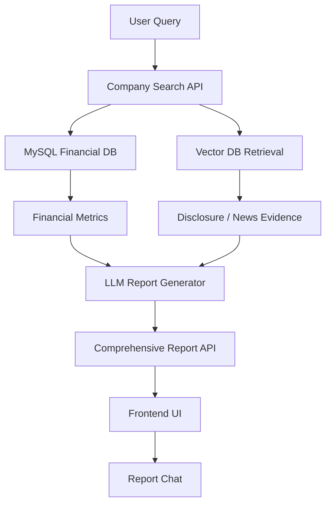

# System Architecture

## Overview

본 시스템은 OpenDART 기반 재무 데이터와 뉴스/공시 기반 정성 데이터를 결합하여
AI 종합 리포트를 생성하는 금융 분석 플랫폼입니다.

정량 데이터는 MySQL에서 관리하고,
정성 데이터는 Pinecone Vector DB 기반 Retrieval 구조를 사용합니다.

---

# Architecture Flow

## System Components

### 1. Data Collection Layer

**OpenDART API**
- 기업 개황 정보 수집
- 재무제표 수집
- 주요사항 공시 수집
- 시장별 기업 메타데이터 수집

**Tavily Search API**
- 기업 관련 뉴스 검색
- 실시간 이슈 탐색
- 검색 결과 evidence 수집

### 2. Storage Layer

**MySQL**

정량 데이터 저장:
- companies
- financial_metrics
- financial_ratios
- warning_signals

**Pinecone Vector DB**

정성 데이터 저장:
- disclosure chunk
- news chunk
- metadata filtering 기반 retrieval

주요 metadata:
- stock_code
- company_name
- signal_code
- signal_type
- industry_group
- data_type

### 3. AI Analysis Layer

**Financial Context Builder**

재무 지표 및 detected_changes를
LLM 입력 구조로 변환합니다.

**Evidence Retrieval**

Vector DB에서 공시/뉴스 근거를 검색합니다.

**Report Writer Chain**

재무 데이터 + 공시 + 뉴스 evidence를 결합하여
최종 AI 리포트를 생성합니다.

**Report Chat Chain**

생성된 리포트 context 기반 후속 질의를 처리합니다.

## Retrieval Flow
signals 생성
↓
detected_changes 변환
↓
query_hint / search_keywords 생성
↓
metadata filtering
↓
Vector DB retrieval
↓
LLM evidence 전달

## Backend Structure

- Django REST Framework
- FastAPI 일부 실험 모듈
- LangChain 기반 AI Pipeline
- Pinecone Vector Retrieval
- OpenAI Embedding (text-embedding-3-small)

## Frontend Structure

- React
- Vite
- Plotly.js
- Report Dashboard UI
- AI Chat Interface

## 특징

- 정량 + 정성 데이터를 함께 활용하는 Hybrid 구조
- metadata filtering 기반 Retrieval
- evidence 기반 hallucination 완화
- 산업별 분석 규칙 적용 가능 구조
- detected_changes 기반 동적 검색 질의 생성